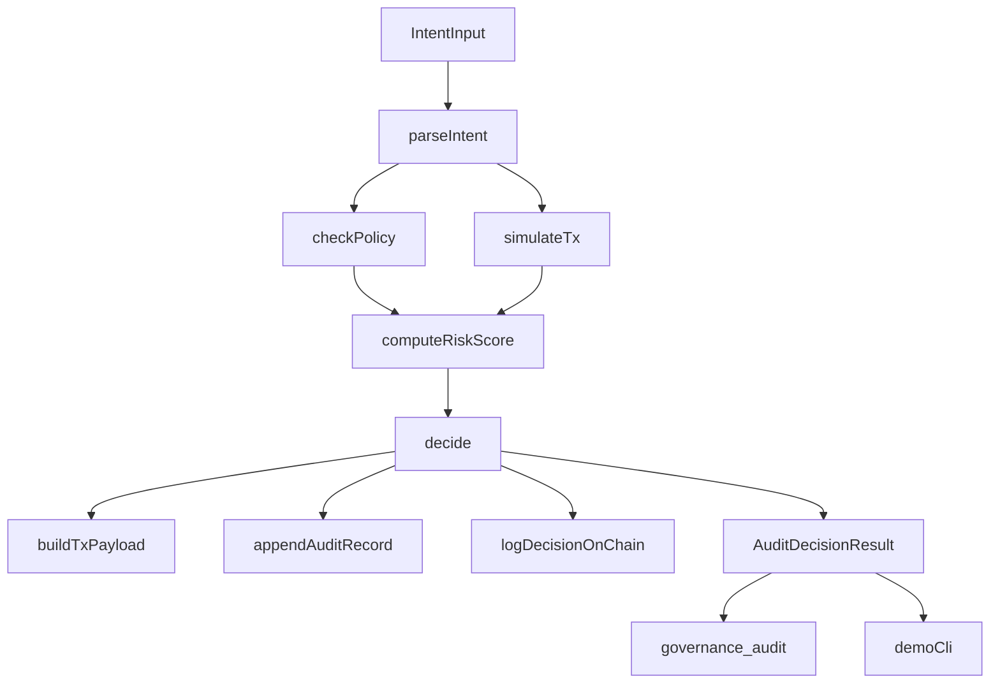

# Agent Governance Auditor

Policy-as-code governance layer for OKX Onchain OS actions.  
It audits each intent before execution, computes risk, explains outcomes, and logs decisions both off-chain and on X Layer.

## Architecture

## What it adds

- Team-specific guardrails over wallet/trade intents.
- Deterministic `AuditDecisionResult` output.
- Explainable decisions (`approved` / `modified` / `blocked`).
- Off-chain append-only logs + on-chain `DecisionLogged` events.

## Quickstart

1. Install dependencies:
   - `npm install`
2. Copy env file:
   - `copy .env.example .env` (Windows)
3. Fill required env vars:
   - `OKX_API_KEY`, `OKX_SECRET_KEY`, `OKX_PASSPHRASE`
   - `X_LAYER_RPC_URL`, `PRIVATE_KEY`
4. Compile and test:
   - `npm run build`
   - `npm test`

## X Layer Contract Deployment (Testnet default)

- Compile: `npm run compile:contracts`
- Deploy: `npm run deploy:contract`
- Set emitted address in `.env` as `RESPONSIBILITY_CONTRACT_ADDRESS`

## Demo

- Run scenarios: `npm run demo`
- Starts from `demo/scenarios.json` and prints:
  - decision
  - explanation
  - risk score
  - tx payload
  - audit id
  - optional on-chain tx hash + explorer URL

## MCP Server

- Run MCP stdio server: `npm run mcp`
- Tool exposed: `governance_audit`
- Input:
  - `intent` (JSON string/object or supported NL phrase)
  - optional `walletAddress`
  - optional `dailyVolumePct`
- Output:
  - stable `AuditDecisionResult` JSON

## Project Layout

- `src/intent.ts`: canonical types + intent parser.
- `src/policy.ts`: policy loading + rule checks.
- `src/clients/*`: wallet/trade/market adapters.
- `src/simulator.ts`: transaction simulation context.
- `src/risk.ts`: deterministic risk model (0 to 1).
- `src/decider.ts`: orchestration entrypoint (`auditIntent`).
- `src/auditLogger.ts`: off-chain append + on-chain logging.
- `contracts/ResponsibilityContract.sol`: governance event contract.
- `scripts/deploy-responsibility-contract.ts`: deployment.
- `src/mcp/*`: MCP manifest and server.
- `demo/*`: runnable scenario demo.
- `tests/*`: module and integration-ish unit tests.
