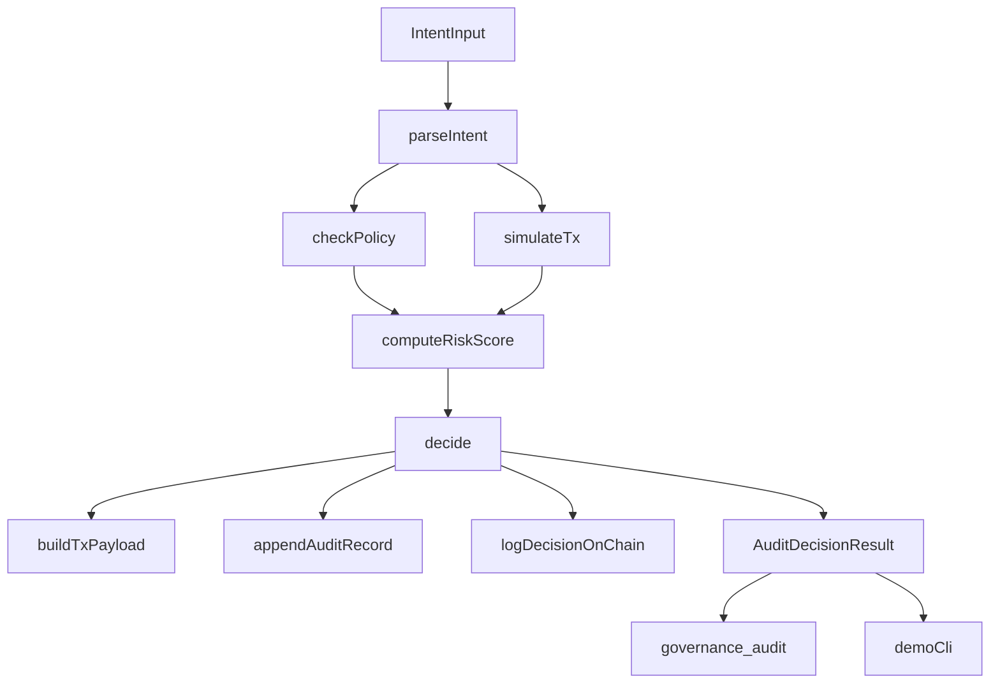
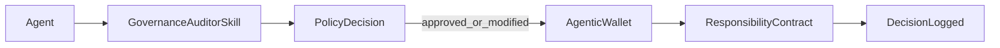

# Agent Governance Auditor

[](https://deepwiki.com/gdev27/agent-governance-auditor)

Policy-as-code governance middleware for AI agent actions on OKX Onchain OS.

This project audits each trade/wallet intent before execution, computes deterministic risk, returns an explainable `approved | modified | blocked` decision, and records accountability logs both off-chain and on X Layer.

## Purpose and Scope

`Agent Governance Auditor` is a hard-control middleware for autonomous agents operating on OKX Onchain OS. It sits between intent generation and transaction execution to enforce policy constraints, evaluate risk with live context, and produce explainable decisions before any action is signed.

This repo focuses on:
- deterministic governance decisions (`approved | modified | blocked`)
- policy-first execution safety for swap/transfer intents
- dual-layer accountability via off-chain and on-chain logs

## Project Intro

`Agent Governance Auditor` is designed for teams building autonomous agents that need hard governance controls before transactions are signed.

Key outcomes:
- Enforces policy caps and allowlists before execution.
- Simulates market/wallet context to score risk.
- Produces normalized output for downstream agents/MCP tools.
- Persists a tamper-evident trail with `DecisionLogged` events on X Layer.

## Architecture Overview



## High-Level Subsystems

- **Governance Core**
  - `checkPolicy`, `computeRiskScore`, `auditIntent`
  - Evaluates controls and produces the final governance decision.
- **OKX Clients**
  - `MarketClient`, `TradeClient`, `WalletClient`
  - Fetches quote, liquidity, and wallet context from Onchain OS APIs.
- **Audit Logging**
  - `appendAuditRecord`, `logDecisionOnChain`, `ResponsibilityContract`
  - Persists off-chain audit records and emits on-chain accountability events.
- **Interfaces**
  - MCP server (`governance_audit`) and demo CLI
  - Exposes governance checks to agents and developers.

## End-to-End Data Flow

1. Parse raw intent into canonical schema.
2. Enforce policy constraints (`allowed_chains`, `allowed_tokens`, caps, slippage, cooldown).
3. Simulate quote/liquidity/wallet context from Onchain OS APIs.
4. Compute deterministic risk score.
5. Derive `approved | modified | blocked` decision and tx payload.
6. Persist append-only off-chain audit record and optional on-chain `DecisionLogged`.

## Working Mechanics

1. Parse user/agent intent into canonical schema.
2. Validate against governance policy (`caps`, `allowed_chains`, `allowed_tokens`, cooldown, slippage).
3. Pull quote/liquidity/wallet context from Onchain OS APIs.
4. Compute deterministic risk score and derive decision.
5. Build execution payload (`okx-dex-swap` or `okx-agentic-wallet` route).
6. Write append-only off-chain audit log and optional on-chain `DecisionLogged`.

## Agentic Wallet Integration

This repo supports two on-chain logging modes through `ONCHAIN_LOG_SIGNER_MODE`:

- `private_key` (local/dev fallback): uses ethers signer from `.env`.
- `agentic_wallet` (production-aligned): executes `ResponsibilityContract.logDecision()` through Agentic Wallet CLI flow (`onchainos wallet contract-call`) so key usage is delegated to Agentic Wallet.

### Production flow



In production, this design aligns with Agentic Wallet as project onchain identity and TEE-backed signing model.

## Chain Configuration Notes

This project uses two chain settings for different responsibilities:

- `X_LAYER_CHAIN_ID`
  - Used for on-chain governance logging (`ResponsibilityContract.logDecision`) and explorer links.
  - For testnet, set: `1952`.
- `ONCHAINOS_DEX_CHAIN_INDEX`
  - Used for Onchain OS DEX/Market/Balance APIs (`dex/aggregator`, `dex/market`, `dex/balance`).
  - Recommended: `196` in the current integration path.

Example:

```env
X_LAYER_CHAIN_ID=1952
X_LAYER_MAINNET_CHAIN_ID=196
ONCHAINOS_DEX_CHAIN_INDEX=196
```

This split keeps governance proofs anchored on X Layer testnet while using a stable DEX/market chain index for API data retrieval.

## Onchain OS Skill Usage Documentation

### Module usage map

- **Agentic Wallet module**
  - Identity and signing for governance transaction logging.
  - Route emitted for transfers: `okx-agentic-wallet`.
- **Trade module**
  - Quote path: `GET /api/v6/dex/aggregator/quote`.
  - Used for simulation and transaction payload preparation.
- **Market module**
  - Token discovery: `GET /api/v6/dex/market/token/search`.
  - Liquidity context: `GET /api/v6/dex/market/token/top-liquidity`.
- **Wallet/balance module**
  - Portfolio value and balances from `dex/balance/*`.
- **x402 Payments**
  - Not required for current MVP.
  - Marked as stretch integration for premium policy/audit gating.

### API examples used in this project

- Swap quote:
  - `GET /api/v6/dex/aggregator/quote?chainIndex=196&fromTokenAddress=...&toTokenAddress=...&amount=...&swapMode=exactIn`
- Wallet total value:
  - `GET /api/v6/dex/balance/total-value-by-address?address=...&chains=196&assetType=0`
- Token search:
  - `GET /api/v6/dex/market/token/search?chains=196&search=USDC`

All REST calls use OKX signed headers: `OK-ACCESS-KEY`, `OK-ACCESS-PASSPHRASE`, `OK-ACCESS-TIMESTAMP`, `OK-ACCESS-SIGN`.

## Deployment

### X Layer testnet deployment

- **Chain ID**: `1952` (X Layer testnet)
- **Contract**: `ResponsibilityContract`
- **Address**: `0x3aEEd5452803123544619A9C0145F268E96e5fA0`
- **Explorer (contract)**: `https://www.oklink.com/xlayer-test/address/0x3aEEd5452803123544619A9C0145F268E96e5fA0`
- **Deployment Tx**: `0x4386861b26052da99a8787c3cee3f5db1ca8a2487100058ee4291981e31610b4`
- **Explorer (tx)**: `https://www.oklink.com/xlayer-test/tx/0x4386861b26052da99a8787c3cee3f5db1ca8a2487100058ee4291981e31610b4`

### Verify deployment

1. Compile contracts:
   - `npm run compile:contracts`
2. Deploy:
   - `npm run deploy:contract`
3. Copy printed address into `.env`:
   - `RESPONSIBILITY_CONTRACT_ADDRESS=0x...`
4. Open deployment tx explorer URL and confirm contract creation.

## Quickstart

1. Install dependencies:
   - `npm install`
2. Copy env file:
   - `copy .env.example .env`
3. Fill required variables:
   - `OKX_API_KEY`, `OKX_SECRET_KEY`, `OKX_PASSPHRASE`
   - `ONCHAINOS_BASE_URL`, `X_LAYER_RPC_URL`, `X_LAYER_CHAIN_ID`
   - `ONCHAINOS_DEX_CHAIN_INDEX` (recommended `196` for DEX/market/balance APIs)
   - `RESPONSIBILITY_CONTRACT_ADDRESS`, `PRIVATE_KEY`
4. Build/test:
   - `npm run build`
   - `npm test`

## CLI Demo

- Note: This project uses `tsx` for ESM support (faster and more reliable than `ts-node`).
- Run:
  - `npm run demo`
- Uses `demo/scenarios.json` and prints:
  - decision, explanation, risk score, policy checks, tx payload, audit id
  - optional on-chain tx hash with X Layer explorer link

## MCP Server Wrapper

- Run MCP stdio server:
  - `npm run mcp`
- Tool:
  - `governance_audit`
- Input:
  - `intent` (JSON object/string or supported NL phrase)
  - optional `walletAddress`, optional `dailyVolumePct`
- Output:
  - stable `AuditDecisionResult` JSON schema

## Team

- **Builder/Developer**: `gdev27`
- **GitHub**: `https://github.com/gdev27`
- **X**: `https://x.com/gdev27`
- **Telegram**: `https://t.me/gdev27`

## X Layer Ecosystem Positioning

- Extends Agentic Wallet by adding pre-trade governance controls and post-decision auditability.
- Converts AI-agent intent into explainable, policy-compliant execution decisions.
- Anchors accountability on X Layer with on-chain governance events and low-friction testnet iteration.
- Built on testnet (`1952`) for rapid MVP validation; architecture is production-portable to mainnet (`196`) with the same policy engine and signer abstraction.

## Project Layout

- `src/intent.ts`: canonical intent types and parser.
- `src/policy.ts`: policy model + rule evaluation.
- `src/clients/*`: Onchain OS API clients and auth signing.
- `src/simulator.ts`: quote/liquidity simulation context.
- `src/risk.ts`: deterministic risk model (`0..1`).
- `src/decider.ts`: orchestration entrypoint (`auditIntent`).
- `src/auditLogger.ts`: off-chain append + on-chain decision logging.
- `contracts/ResponsibilityContract.sol`: governance event contract.
- `scripts/deploy-responsibility-contract.ts`: deploy helper.
- `src/mcp/*`: MCP manifest and stdio server.
- `demo/*`: scenario runner.
- `tests/*`: Vitest suite.
