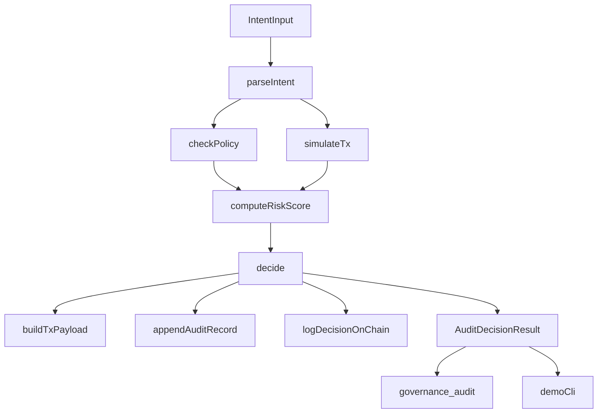
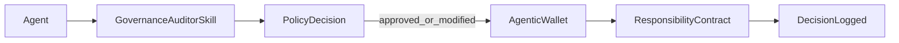

# Agent Governance Auditor

Policy-as-code governance middleware for AI agent actions on OKX Onchain OS.

This project audits each trade/wallet intent before execution, computes deterministic risk, returns an explainable `approved | modified | blocked` decision, and records accountability logs both off-chain and on X Layer.

## Project Intro

`Agent Governance Auditor` is designed for teams building autonomous agents that need hard governance controls before transactions are signed.

Key outcomes:
- Enforces policy caps and allowlists before execution.
- Simulates market/wallet context to score risk.
- Produces normalized output for downstream agents/MCP tools.
- Persists a tamper-evident trail with `DecisionLogged` events on X Layer.

## Architecture Overview

## Working Mechanics

1. Parse user/agent intent into canonical schema.
2. Validate against governance policy (`caps`, `allowed_chains`, `allowed_tokens`, cooldown, slippage).
3. Pull quote/liquidity/wallet context from Onchain OS APIs.
4. Compute deterministic risk score and derive decision.
5. Build execution payload (`okx-dex-swap` or `okx-agentic-wallet` route).
6. Write append-only off-chain audit log and optional on-chain `DecisionLogged`.

## Agentic Wallet Integration

This repo supports two on-chain logging modes through `ONCHAIN_LOG_SIGNER_MODE`:

- `private_key` (local/dev fallback): uses ethers signer from `.env`.
- `agentic_wallet` (production-aligned): executes `ResponsibilityContract.logDecision()` through Agentic Wallet CLI flow (`onchainos wallet contract-call`) so key usage is delegated to Agentic Wallet.

### Production flow (recommended for Build X)

In production, this design aligns with Agentic Wallet as project onchain identity and TEE-backed signing model.

## Onchain OS Skill Usage Documentation

### Module usage map

- **Agentic Wallet module**
  - Identity and signing for governance transaction logging.
  - Route emitted for transfers: `okx-agentic-wallet`.
- **Trade module**
  - Quote path: `GET /api/v6/dex/aggregator/quote`.
  - Used for simulation and transaction payload preparation.
- **Market module**
  - Token discovery: `GET /api/v6/dex/market/token/search`.
  - Liquidity context: `GET /api/v6/dex/market/token/top-liquidity`.
- **Wallet/balance module**
  - Portfolio value and balances from `dex/balance/*`.
- **x402 Payments**
  - Not required for current MVP.
  - Marked as stretch integration for premium policy/audit gating.

### API examples used in this project

- Swap quote:
  - `GET /api/v6/dex/aggregator/quote?chainIndex=1952&fromTokenAddress=...&toTokenAddress=...&amount=...&swapMode=exactIn`
- Wallet total value:
  - `GET /api/v6/dex/balance/total-value-by-address?address=...&chains=1952&assetType=0`
- Token search:
  - `GET /api/v6/dex/market/token/search?chains=1952&search=USDC`

All REST calls use OKX signed headers: `OK-ACCESS-KEY`, `OK-ACCESS-PASSPHRASE`, `OK-ACCESS-TIMESTAMP`, `OK-ACCESS-SIGN`.

## Deployment

### X Layer testnet deployment

- **Chain ID**: `1952` (X Layer testnet)
- **Contract**: `ResponsibilityContract`
- **Address**: `0x3aEEd5452803123544619A9C0145F268E96e5fA0`
- **Explorer (contract)**: `https://www.oklink.com/xlayer-test/address/0x3aEEd5452803123544619A9C0145F268E96e5fA0`
- **Deployment Tx**: `0x4386861b26052da99a8787c3cee3f5db1ca8a2487100058ee4291981e31610b4`
- **Explorer (tx)**: `https://www.oklink.com/xlayer-test/tx/0x4386861b26052da99a8787c3cee3f5db1ca8a2487100058ee4291981e31610b4`

### Verify deployment

1. Compile contracts:
   - `npm run compile:contracts`
2. Deploy:
   - `npm run deploy:contract`
3. Copy printed address into `.env`:
   - `RESPONSIBILITY_CONTRACT_ADDRESS=0x...`
4. Open deployment tx explorer URL and confirm contract creation.

## Quickstart

1. Install dependencies:
   - `npm install`
2. Copy env file:
   - `copy .env.example .env`
3. Fill required variables:
   - `OKX_API_KEY`, `OKX_SECRET_KEY`, `OKX_PASSPHRASE`
   - `ONCHAINOS_BASE_URL`, `X_LAYER_RPC_URL`, `X_LAYER_CHAIN_ID`
   - `ONCHAINOS_DEX_CHAIN_INDEX` (recommended `196` for DEX/market/balance APIs)
   - `RESPONSIBILITY_CONTRACT_ADDRESS`, `PRIVATE_KEY`
4. Build/test:
   - `npm run build`
   - `npm test`

## CLI Demo

- Note: This project uses `tsx` for ESM support (faster and more reliable than `ts-node`).
- Run:
  - `npm run demo`
- Uses `demo/scenarios.json` and prints:
  - decision, explanation, risk score, policy checks, tx payload, audit id
  - optional on-chain tx hash with X Layer explorer link

## MCP Server Wrapper

- Run MCP stdio server:
  - `npm run mcp`
- Tool:
  - `governance_audit`
- Input:
  - `intent` (JSON object/string or supported NL phrase)
  - optional `walletAddress`, optional `dailyVolumePct`
- Output:
  - stable `AuditDecisionResult` JSON schema

## Team

- **Builder/Developer**: `gdev27`
- **GitHub**: `https://github.com/gdev27`
- **X**: `https://x.com/gdev27`
- **Telegram**: `https://t.me/gdev27`

## X Layer Ecosystem Positioning

- Extends Agentic Wallet by adding pre-trade governance controls and post-decision auditability.
- Converts AI-agent intent into explainable, policy-compliant execution decisions.
- Anchors accountability on X Layer with on-chain governance events and low-friction testnet iteration.
- Built on testnet (`1952`) for rapid MVP validation; architecture is production-portable to mainnet (`196`) with the same policy engine and signer abstraction.

## Build X Submission Checklist

- Public GitHub repo with complete README sections.
- Agentic Wallet integration path clearly documented and implemented in code (`agentic_wallet` signer mode).
- At least one Onchain OS module integrated (Trade/Market/Wallet modules are used).
- X Layer smart contract deployed and explorer proof included.
- CLI demo output showing end-to-end governance decision flow.
- Moltbook `m/buildx` submission using required template fields.

## Submission Mechanics (Build X)

- Primary review surface: Moltbook submission post in `m/buildx` with required template.
- Contact for reviewers:
  - GitHub: `https://github.com/gdev27`
  - X: `https://x.com/gdev27`
  - Telegram: `https://t.me/gdev27`
- Technical proof judges can inspect:
  - this public GitHub repo and README
  - X Layer deployment tx + contract explorer links
  - CLI demo output and on-chain decision log tx hashes
- Demo video is optional but recommended (`1-3` minutes) for stronger presentation.

## Project Layout

- `src/intent.ts`: canonical intent types and parser.
- `src/policy.ts`: policy model + rule evaluation.
- `src/clients/*`: Onchain OS API clients and auth signing.
- `src/simulator.ts`: quote/liquidity simulation context.
- `src/risk.ts`: deterministic risk model (`0..1`).
- `src/decider.ts`: orchestration entrypoint (`auditIntent`).
- `src/auditLogger.ts`: off-chain append + on-chain decision logging.
- `contracts/ResponsibilityContract.sol`: governance event contract.
- `scripts/deploy-responsibility-contract.ts`: deploy helper.
- `src/mcp/*`: MCP manifest and stdio server.
- `demo/*`: scenario runner.
- `tests/*`: Vitest suite.
